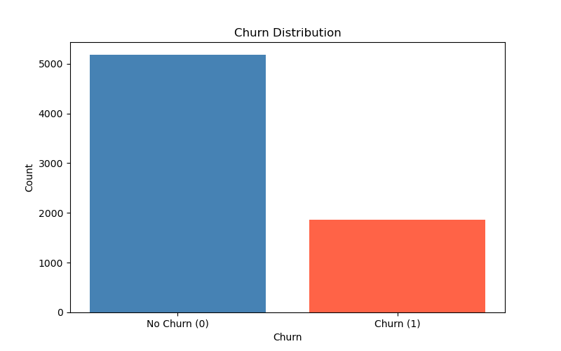
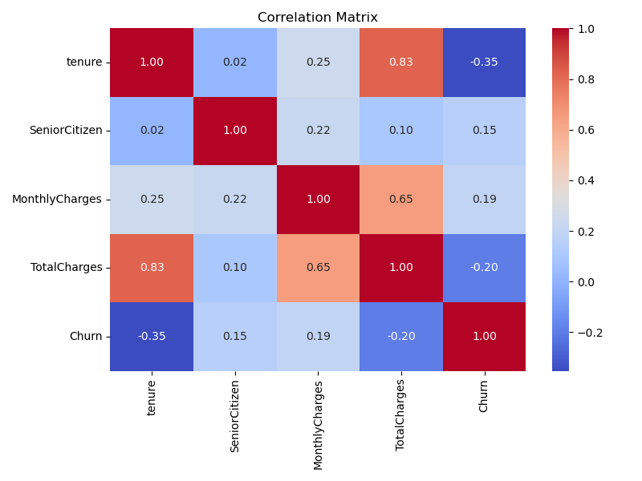
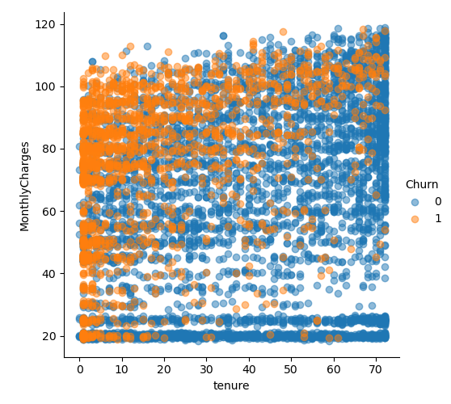

# 📊 Customer Churn EDA — Telco Dataset

## 📌 Project Overview
Exploratory Data Analysis on IBM Telco Customer Churn dataset
to find key factors that cause customers to leave a telecom company.

---

## 📁 Dataset Info
- Source: IBM Telco Dataset (Kaggle)
- Rows: 7043
- Columns: 20 (after dropping customerID)
- Target Column: Churn (Yes=1, No=0)

---

## 🛠️ Libraries Used
- Python, Pandas, NumPy
- Matplotlib, Seaborn
- Scipy (Chi-square, ANOVA)

---

## 📊 EDA Steps
- Step 1 — Import Libraries
- Step 2 — Load Data
- Step 3 — First Look
- Step 4 — Drop Unnecessary Columns
- Step 5 — Handle Missing Values
- Step 6 — Encode Categorical Columns
- Step 7 — Univariate Analysis (13 graphs)
- Step 8 — Bivariate Analysis (Chi-square + ANOVA)
- Step 9 — Multivariate Analysis (Heatmap + Scatter)
- Step 10 — Conclusions

---

## 🔑 Key Findings
- Contract type is STRONGEST predictor of churn
- Gender and PhoneService have NO effect on churn
- New customers with high monthly charges churn the most
- Customers without OnlineSecurity and TechSupport churn more
- Fiber optic internet users churn more than DSL users
- Long tenure customers rarely churn

---

## 💡 Key Message
Telecom company should focus on new customers with
month-to-month contracts — they are at highest risk of churning.
Offering long-term contracts and security services can reduce churn significantly.

---

## 📸 Sample Graphs

